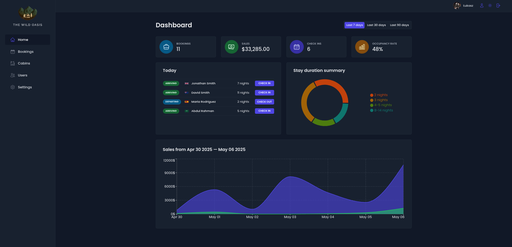
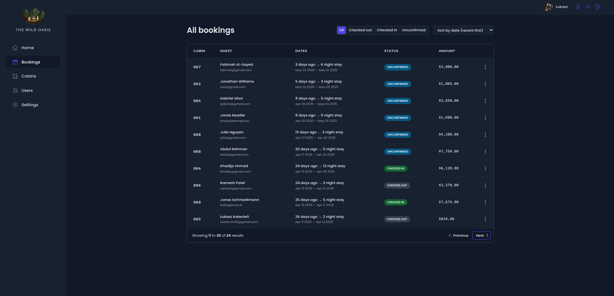
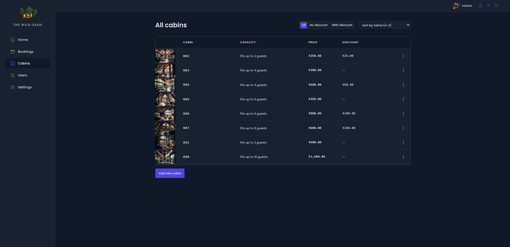

# The Wild Oasis


A modern hotel management application built with React, designed to streamline daily operations for hotel employees. This full-stack application enables staff to manage bookings, cabins, guests, and track performance metrics through an intuitive dashboard.

## 🏨 Features

- **Authentication & User Management**: Secure login system for hotel employees with different access levels
- **Dashboard**: Real-time statistics displaying booking data, occupancy rates, and revenue metrics
- **Booking Management**: Create, view, update, and delete guest reservations
- **Cabin Administration**: Manage cabin inventory, details, and pricing
- **Check-in/Check-out System**: Streamlined process for guest arrivals and departures
- **Dark/Light Mode**: Customizable UI theme for user preference
- **Responsive Design**: Optimized for both desktop and tablet use by hotel staff

## 🛠️ Technologies

### Frontend
- **React** with React Router for navigation
- **Styled Components** for component-based styling
- **React Query** for efficient server-state management
- **React Hook Form** for form validation and handling
- **Recharts** for data visualization
- **React Hot Toast** for notifications

### Backend
- **Supabase** providing:
  - Database
  - Authentication
  - Storage for cabin images
  - Security with Row Level Security (RLS)

## 🚀 Getting Started

### Prerequisites
- Node.js (v18 or higher)
- npm

### Installation

1. Clone the repository
   ```bash
   git clone https://github.com/dubstabber/the-wild-oasis.git
   cd the-wild-oasis
   ```

2. Install dependencies
   ```bash
   npm install
   # or
   yarn
   ```

3. Start the development server
   ```bash
   npm run dev
   # or
   yarn dev
   ```

4. Open your browser and navigate to http://localhost:5173

## 📸 Screenshots





## 🧪 Key Learning Outcomes

During the development of this project, I gained experience with:

- Building a complete full-stack application with React and Supabase
- Implementing authentication and protected routes
- Using React Query for efficient data fetching and caching
- Creating reusable UI components
- Implementing dark/light theme with styled-components
- Data visualization with Recharts
- Form validation and management

## 🔮 Future Enhancements

- Mobile application for guests to make reservations
- Integration with payment processing systems
- Email notification system for booking confirmations
- Guest profile management system

---

## Portfolio Project Note

This project demonstrates my ability to build complex, full-stack applications with modern React patterns and best practices. It showcases my skills in:

- Component architecture and state management
- Authentication and authorization
- API integration and data handling
- UI/UX design with responsive layouts
- Performance optimization techniques

Feel free to reach out with any questions about my implementation or design choices!
